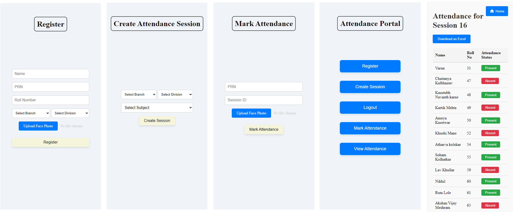

# Geo Location and Facial Recognition Based Attendance System

This project is a full-stack application that uses geo-location and facial recognition to mark attendance. It is built using React for the frontend, Express and Node.js for the backend, MySQL for the database, and Python with OpenCV for facial recognition.

## Table of Contents

- Features
- Project Structure
- Setup Guide
- API Routes
- Workflow
- Dependencies

## Features

- User registration with facial recognition
- Faculty login
- Create attendance sessions
- Mark attendance using geo-location and facial recognition
- View attendance records
- Download attendance records as Excel files

## Project Structure

```
.
├── client
│   ├── public
│   ├── src
│   │   ├── api.js
│   │   ├── App.jsx
│   │   ├── components
│   │   │   ├── Attendance.jsx
│   │   │   ├── CreateSession.jsx
│   │   │   ├── Home.jsx
│   │   │   ├── Login.jsx
│   │   │   ├── Register.jsx
│   │   │   ├── ViewAllStudents.jsx
│   │   │   ├── ViewAttendance.jsx
│   │   │   └── ViewSessions.jsx
│   │   ├── getLocation.js
│   │   └── main.jsx
│   ├── .env
│   ├── package.json
│   ├── vite.config.js
│   └── README.md
├── server
│   ├── config
│   │   ├── db.js
│   │   └── multer.js
│   ├── controllers
│   │   ├── attendanceController.js
│   │   └── authController.js
│   ├── routes
│   │   ├── attendanceRoutes.js
│   │   └── authRoutes.js
│   ├── uploads
│   ├── .env
│   ├── app.js
│   ├── package.json
│   └── vercel.json
├── app.py
├── requirements.txt
└── README.md
```

## Setup Guide

### Prerequisites

- Node.js
- Python
- MySQL

### Backend Setup

1. Clone the repository:
   ```sh
   git clone https://github.com/Sohamk130405/Geo_Attendance.git
   cd Geo_Attendance/server
   ```

2. Install dependencies:
   ```sh
   npm install
   ```

3. Create a `.env` file in the server directory and add the following:
   ```
   PORT=5000
   PYTHON_URL=http://localhost:8080
   ```

4. Start the backend server:
   ```sh
   node app.js
   ```

### Frontend Setup

1. Navigate to the client directory:
   ```sh
   cd ../client
   ```

2. Install dependencies:
   ```sh
   npm install
   ```

3. Create a `.env` file in the client directory and add the following:
   ```
   VITE_REACT_APP_SERVER_BASEURL=http://localhost:5000/api
   ```

4. Start the frontend server:
   ```sh
   npm run dev
   ```

### Python Setup

1. Navigate to the root directory:
   ```sh
   cd ../
   ```

2. Create a virtual environment and activate it:
   ```sh
   python -m venv venv
   source venv/bin/activate  # On Windows, use `venv\Scripts\activate`
   ```

3. Install dependencies:
   ```sh
   pip install -r requirements.txt
   ```

4. Start the Python server:
   ```sh
   python app.py
   ```

## API Routes

### Authentication Routes

- **POST /api/auth/register**
  - Registers a new student with facial recognition.
  - Request body: `name`, `prn`, `rollNo`, `branch`, `division`, `facePhoto`

- **POST /api/auth/login**
  - Logs in a faculty member.
  - Request body: `email`, `password`

### Attendance Routes

- **POST /api/attendance/create-session**
  - Creates a new attendance session.
  - Request body: `facultyId`, `subject`, `branch`, `division`, `latitude`, `longitude`

- **POST /api/attendance/mark-attendance**
  - Marks attendance for a student.
  - Request body: `prn`, `sessionId`, `studentLatitude`, `studentLongitude`, `facePhoto`

- **GET /api/attendance/:sessionId**
  - Retrieves attendance data for a session.
  - URL parameter: `sessionId`

- **PUT /api/attendance/:sessionId/:studentId**
  - Toggles attendance status for a student.
  - URL parameters: `sessionId`, `studentId`

- **GET /api/attendance/sessions/:id**
  - Retrieves all sessions for a faculty member.
  - URL parameter: `id`

- **GET /api/attendance/students**
  - Retrieves all students.

## Workflow

1. **Registration**: Students register by providing their details and uploading a face photo. The face photo is processed and stored for future recognition.
2. **Login**: Faculty members log in using their email and password.
3. **Create Session**: Faculty members create an attendance session by providing session details and their current location.
4. **Mark Attendance**: Students mark their attendance by providing their PRN, session ID, current location, and face photo. The system verifies their location and face before marking attendance.
5. **View Attendance**: Faculty members and students can view attendance records. Faculty members can also download the records as Excel files.

## Dependencies

### Backend

- express
- body-parser
- cors
- mysql2
- multer
- axios
- dotenv

### Frontend

- react
- react-dom
- react-router-dom
- react-toastify
- axios
- vite

### Python

- Flask
- face-recognition
- opencv-python
- numpy
- pillow


## Results



---

Feel free to contribute to this project by submitting issues or pull requests. For any questions, please contact the project maintainer.